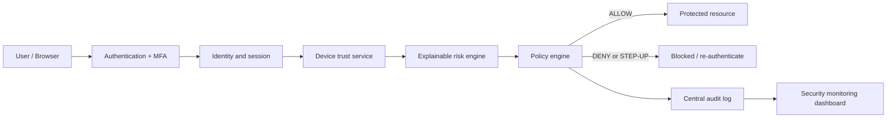

# Implementation of Zero Trust Architecture

## A Research-Based Study for Enterprise Security

This repository is a runnable Zero Trust Architecture (ZTA) demonstration for an enterprise security research project. It is deliberately built around the security decision path rather than a conventional CRUD workflow:

`identity -> MFA -> device posture -> risk score -> policy -> authorization -> audit log`

The same pipeline is called by the UI and enforced server-side at `POST /access/evaluate`. The frontend cannot grant itself access.

## What is included

- FastAPI API with SQLite persistence and seeded demo identities, devices, sessions and policies
- Signed expiring access tokens, session revocation, MFA demo gate and salted PBKDF2 password hashing fallback
- Explainable device trust and risk scoring from 0-100
- Default-deny RBAC policy evaluation returning `ALLOW`, `DENY` or `STEP_UP_AUTHENTICATION`
- Centralized audit logging for every access decision
- Responsive Sentinel SOC console with employee, analyst and admin-oriented views
- Security event table, live decision simulator and research notes view
- Automated backend tests for the core evaluation scenarios
- OpenAPI documentation at `/docs`

## Configuration

Copy `.env.example` for backend settings and `frontend/.env.example` for Vite settings. Never commit a real `ZTA_SECRET_KEY`.

Required deployment variables:

- `ZTA_SECRET_KEY`: strong deployment-only signing secret.
- `ZTA_DB_PATH`: SQLite file path. Render is configured for `/var/data/zta.db` in `render.yaml`.
- `ALLOWED_ORIGINS`: comma-separated exact frontend origins, for example the deployed Vercel origin.
- `VITE_API_URL`: deployed Render backend URL, injected into the Vercel build.

The seeded credentials are demo credentials only and must not be reused outside the research demonstration:

- Demo password: `Demo@123`
- Demo OTP: `123456` (simulated MFA, clearly labeled demo-only)

## Quick start

### Backend

```powershell
cd backend
python -m pip install -r requirements.txt
set ALLOWED_ORIGINS=https://your-frontend-domain.example
uvicorn main:app --host 0.0.0.0 --port 8000
```

### Frontend

```powershell
cd frontend
npm install
npm run dev
```

For local development, set `VITE_API_URL` in the frontend environment to the backend address you are running. The application has no baked-in API host.

| Identity | Role | Demonstration |
| --- | --- | --- |
| employee@acme.test | employee | Internal allow, restricted deny, unmanaged-device challenge |
| analyst@acme.test | analyst | Security events and audit trail |
| admin@acme.test | admin | Security dashboard and elevated policy scope |
| guest@acme.test | guest | Least-privilege default deny |

## Architecture



## Research evaluation matrix

| Case | User | Device | Resource | Expected |
| --- | --- | --- | --- | --- |
| TC01 | Employee | Trusted | Employee Directory | ALLOW |
| TC02 | Employee | Trusted | Financial Reports | DENY |
| TC03 | Employee | Unmanaged | Employee Directory | STEP-UP or DENY |
| TC04 | Admin | Trusted | Admin scope | ALLOW when a matching policy exists |
| TC05 | Guest | Trusted | Confidential data | DENY |
| TC06 | Employee | Suspicious IP | Internal resource | DENY or STEP-UP |

Run the automated evaluation with:

```powershell
python -m pytest backend/test_security.py -q
```

## Security notes

The default secret is intentionally demo-only. Set `ZTA_SECRET_KEY` from `.env.example` before any non-demo deployment. In a production deployment, replace the compatibility PBKDF2/token helpers with the pinned `passlib[bcrypt]` and `python-jose` packages in a verified virtual environment, add refresh-token rotation, real TOTP enrollment, CSRF protection for cookie sessions, a production rate limiter, PostgreSQL, and managed secret storage.

## Research references

- NIST, *SP 800-207: Zero Trust Architecture*, 2020: https://csrc.nist.gov/publications/detail/sp/800-207/final
- CISA, *Zero Trust Maturity Model*, Version 2.0, 2023: https://www.cisa.gov/resources-tools/resources/zero-trust-maturity-model
- NIST, *Cybersecurity Framework 2.0*, 2024: https://www.nist.gov/cyberframework
- OWASP, *Authentication Cheat Sheet*: https://cheatsheetseries.owasp.org/cheatsheets/Authentication_Cheat_Sheet.html
- OWASP, *Authorization Cheat Sheet*: https://cheatsheetseries.owasp.org/cheatsheets/Authorization_Cheat_Sheet.html

See [docs/research.md](docs/research.md) for the written research component and limitations.

## Deployment

### Backend — Render

Create a Render Web Service from this repository.

Build command:

```text
pip install -r backend/requirements.txt
```

Start command:

```text
uvicorn backend.main:app --host 0.0.0.0 --port $PORT
```

Set these Render environment variables:

```text
ZTA_SECRET_KEY=<generate-a-strong-random-secret>
ZTA_DB_PATH=/var/data/zta.db
ALLOWED_ORIGINS=<DEPLOYED_FRONTEND_URL>
```

The service initializes the SQLite schema and seed data at startup. `/health` is suitable for a Render health check, and `/docs` exposes Swagger/OpenAPI. SQLite storage is suitable for the initial research/demo deployment; use a persistent Render disk mounted at `/var/data` or migrate to PostgreSQL before production scale.

`render.yaml` contains the reproducible service configuration. Its secret and origin values are intentionally unsynchronized and must be entered in Render.

### Frontend — Vercel

Import the `frontend` directory as the Vercel project, or configure the repository root with the frontend project settings.

Build command:

```text
npm run build
```

Output directory:

```text
dist
```

Set this Vercel environment variable for the Production build:

```text
VITE_API_URL=<DEPLOYED_BACKEND_URL>
```

After deployment, set the exact Vercel origin as Render's `ALLOWED_ORIGINS`. Do not use a wildcard origin. The backend continues to enforce authentication and authorization server-side; CORS only controls which browser origins may read responses.
