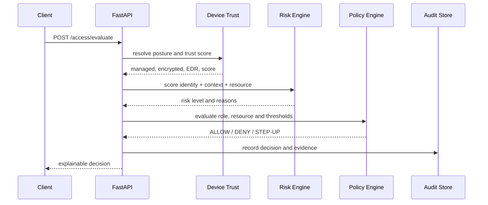

# Research Component

## Abstract

Traditional enterprise security assumes that a user inside a network boundary is safer than a user outside it. Zero Trust Architecture removes that implicit trust. The prototype in this project treats each sensitive request as a new decision using identity, role, MFA state, device posture, IP reputation, resource sensitivity and current risk.

## From perimeter to context

Perimeter security concentrates controls at the network edge. This can protect an office network, but it has weak assumptions when users work remotely, cloud services communicate directly, or a valid account is compromised. ZTA moves the enforcement point closer to the resource and uses policy decisions that are independent of network location.

## Architecture mapping

The project maps the NIST ZTA vocabulary into small, inspectable services:

- **Policy engine:** selects an enabled role/resource policy and applies thresholds.
- **Policy information:** device trust, risk reasons, role, MFA and request context.
- **Policy enforcement:** `/access/evaluate` returns the decision before a resource is exposed.
- **Continuous monitoring:** each decision becomes an immutable audit record for the dashboard.

## Risk model

The score is intentionally explainable rather than an opaque AI model. Unmanaged state, disabled encryption, inactive EDR, low device trust, suspicious documentation IP ranges, sensitive resources and recent failed logins add bounded points. Scores map to LOW (0-30), MEDIUM (31-60), HIGH (61-80) and CRITICAL (81-100). Reasons are returned with every decision so a reviewer can reproduce the result.

## Advantages and limitations

The design demonstrates least privilege, identity-centric access, continuous authorization, explicit device evidence and centralized auditability. It is not a production IAM platform. Its MFA code is a safe demo shortcut, the device inventory is simulated, the policy administration API is intentionally the next extension, and SQLite is appropriate for local evaluation but not high-scale concurrent telemetry.

## Future scope

Production work would add real TOTP enrollment and QR provisioning, refresh-token rotation, PostgreSQL migrations, a policy-management screen over the existing admin policy API, device attestation integrations, IP reputation feeds, tamper-evident log shipping, micro-segmentation controls and a formal precision/recall evaluation over a larger synthetic request set.

## References

1. NIST. *SP 800-207: Zero Trust Architecture*. National Institute of Standards and Technology, 2020. https://csrc.nist.gov/publications/detail/sp/800-207/final
2. CISA. *Zero Trust Maturity Model, Version 2.0*. Cybersecurity and Infrastructure Security Agency, 2023. https://www.cisa.gov/resources-tools/resources/zero-trust-maturity-model
3. NIST. *Cybersecurity Framework 2.0*. National Institute of Standards and Technology, 2024. https://www.nist.gov/cyberframework
4. OWASP Foundation. *Authentication Cheat Sheet*. https://cheatsheetseries.owasp.org/cheatsheets/Authentication_Cheat_Sheet.html
5. OWASP Foundation. *Authorization Cheat Sheet*. https://cheatsheetseries.owasp.org/cheatsheets/Authorization_Cheat_Sheet.html